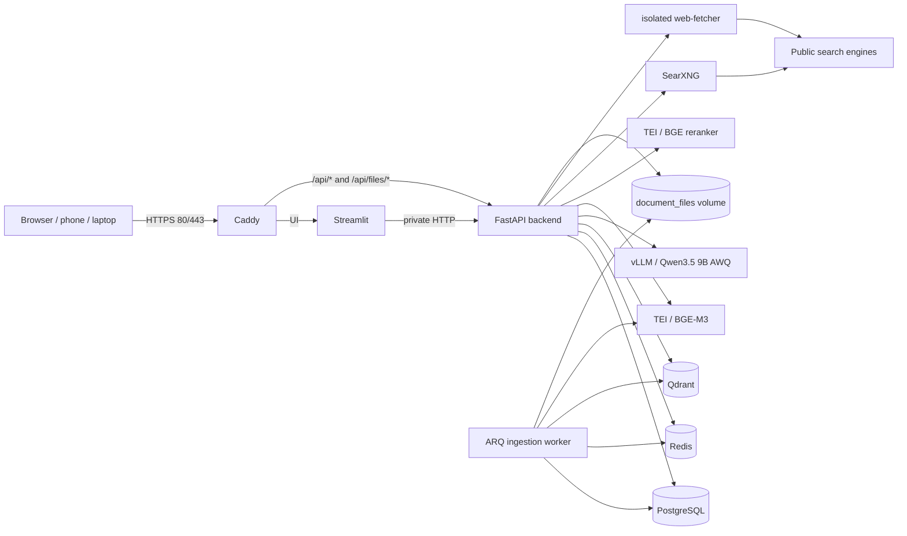
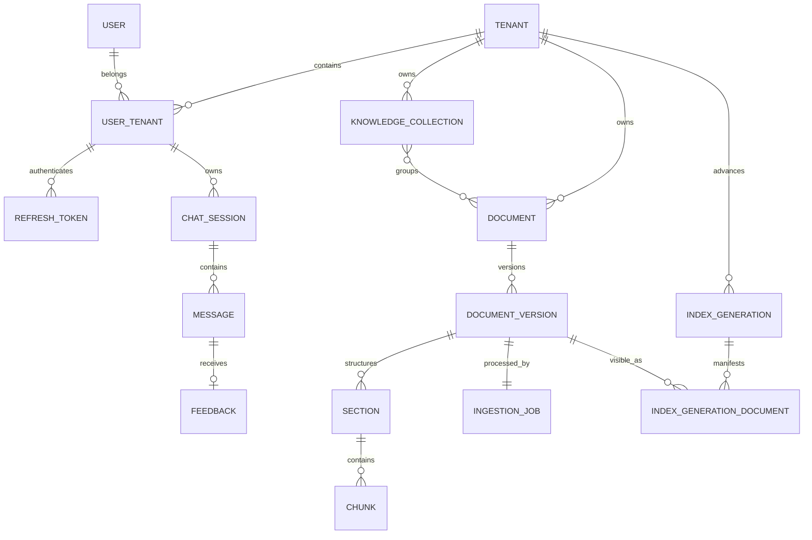

# ETOERAGCB architecture

This document is the technical handoff for engineers co-developing the project.
It assumes familiarity with Python, FastAPI, PostgreSQL, vector databases,
embeddings, reranking, LLM serving, RAG, Docker, and basic security practices.

The deployment is currently LAN-only. The application architecture is ready for
normal development and testing, but public DNS/ACME exposure and the final host
reboot release drill are intentionally deferred.

## Contents

1. System in one page
2. Repository map
3. Runtime components
4. Docker network and trust boundaries
5. Domain and persistence model
6. Authentication and authorization
7. Document ingestion lifecycle
8. Retrieval and answer lifecycle
9. API surface
10. Configuration and reproducibility
11. Observability, maintenance, and recovery
12. Testing and evaluation
13. Development guidance
14. Current limits and deferred work

## 1. System in one page

ETOERAGCB is a closed-registration, multi-tenant RAG chat application. A
Streamlit UI calls a FastAPI API through Caddy HTTPS. Documents are stored as
versioned raw files, structured sections/chunks in PostgreSQL, and dense+sparse
vectors in Qdrant. An ARQ worker performs ingestion. Retrieval uses a bounded
LLM planner, PostgreSQL-authorized metadata resolution, hybrid Qdrant search,
cross-encoder reranking, deterministic deduplication and context packing, and a
calibrated confidence gate. Grounded answers are generated by a locally served
Qwen model and streamed as citation-safe SSE.

The most important data-ownership rule is:

> PostgreSQL is authoritative for identity, tenancy, document visibility,
> active index generations, chat history, and ingestion state. Qdrant is a
> derived retrieval index. Redis is disposable acceleration and queue state.



## 2. Repository map

| Path | Responsibility |
|---|---|
| `backend/app/main.py` | FastAPI application assembly, middleware, health, readiness, and metrics |
| `backend/app/config.py` | Frozen Pydantic settings and cross-field safety validation |
| `backend/app/models/` | SQLAlchemy domain models and tenant-aware constraints |
| `backend/alembic/` | PostgreSQL schema migrations |
| `backend/app/auth/` | Login, rotating refresh tokens, principals, roles, and rate limiting |
| `backend/app/sessions/` | Private chat sessions, messages, pagination, and feedback |
| `backend/app/collections/` | Tenant collections and document membership |
| `backend/app/documents/` | Upload/reindex APIs, file validation, queueing, and signed files |
| `backend/app/ingest/` | Parsing, normalization, sectioning, chunking, embedding, indexing, activation, and reconciliation |
| `backend/app/rag/` | Planning, scope resolution, hybrid retrieval, web retrieval, reranking, packing, and confidence gating |
| `backend/app/chat/` | End-to-end chat transaction, vLLM streaming, citations, SSE, and replay |
| `backend/app/web/` | Isolated SSRF-resistant page fetch service |
| `backend/app/evaluation/` | Golden-set evaluation, metric reporting, calibration, and feedback export |
| `backend/app/operations/` | Backup preparation/verification and retention maintenance |
| `backend/app/workers.py` | ARQ worker startup, ingestion task, reconciliation, and scheduled maintenance |
| `streamlit_app/` | API-only Streamlit client and SSE state machine |
| `deploy/compose.yml` | Normal application deployment and optional operations/monitoring profiles |
| `deploy/restore-compose.yml` | Isolated clean-volume restore drill only |
| `p0/compose.yml` | Hardware/model qualification only; it is not the application stack |
| `deploy/Caddyfile*` | Public-ACME and LAN-internal-CA ingress variants |
| `deploy/monitoring/` | Prometheus scrape/rules and Alertmanager template |
| `deploy/*.sh` | Backup, restore, audit, load, release, and failure-drill entrypoints |
| `model-revisions.lock` | Exact Hugging Face model revisions and cache paths |
| `docker-images.lock` | Immutable third-party image digests |
| `docs/` | Phase-specific contracts, evidence, and operational runbooks |
| `rag-chatbot-plan.md` | Original phased requirements and acceptance plan |

## 3. Runtime components

### Caddy

Caddy is the only host-published application service. It publishes TCP 80 and
443, redirects HTTP to HTTPS, adds security headers, limits request bodies, and
routes:

- `/api/*` and `/api/files/*` to FastAPI;
- everything else to Streamlit;
- `/api/readyz` and `/api/metrics` to a deliberate public 404.

`deploy/Caddyfile.lan` uses Caddy's internal CA. `deploy/Caddyfile` uses public
ACME. The LAN certificate root must be trusted by each test device.

### Streamlit

The UI is deliberately thin. It stores access/refresh tokens only in
Streamlit's server-side session state and uses `streamlit_app/api_client.py` for
all backend operations. It never connects directly to PostgreSQL, Redis,
Qdrant, model servers, document storage, or web services.

The views are:

- `views/chat.py`: private sessions, scoped chat, web-search option, SSE,
  citations, signed links, and feedback;
- `views/documents.py`: inventory/status for members and upload/reindex/delete
  controls for admins;
- `views/collections.py`: collection inventory for members and mutation for
  admins.

`streamlit_app/sse.py` is the client-side protocol authority. In particular, a
`replace` event supersedes accumulated deltas.

### FastAPI backend

`app.main.create_app()` assembles the API and its runtime dependencies. In
production, OpenAPI/Swagger routes are disabled. Middleware enforces:

- allowed host names;
- configured CORS origins;
- origin checks for state-changing `/api` requests;
- bounded request IDs;
- no-store behavior for token routes;
- structured request logging and Prometheus metrics.

The application lifespan owns database, Redis rate limiter, chat runtime,
readiness clients, and clean shutdown.

### ARQ worker

`app.workers.WorkerSettings` runs:

- `ingest_document`: the document ingestion pipeline;
- startup and once-per-minute ingestion reconciliation;
- daily maintenance at 03:15.

The durable ingestion job and heartbeat live in PostgreSQL. Redis delivery is
not the source of truth, so stale work can be safely reconciled after a worker
failure.

### PostgreSQL

PostgreSQL 16 stores all authoritative relational state. SQLAlchemy is used at
runtime and Alembic owns schema evolution. Composite foreign keys repeatedly
bind child rows to tenant IDs; do not remove those redundant-looking tenant
columns or constraints without a deliberate isolation review.

### Qdrant

One collection, `rag_chunks_v1`, stores named `dense` and `sparse` vectors plus
filterable provenance payload. Qdrant payload text is not trusted as the
authoritative source during retrieval; selected point IDs are rehydrated from
PostgreSQL under the active tenant/version scope.

### Redis

Redis provides:

- ARQ queue state;
- rate-limit counters;
- JSON caches for planning, retrieval, and reranking.

Cache operations fail open. Cache keys bind tenant, model/algorithm revisions,
active index generation, and `retrieval_revision` where applicable. The answer
cache is disabled by default.

### Local model services

The model containers run offline from read-only Hugging Face snapshots:

| Purpose | Service | Model |
|---|---|---|
| Planning and answer generation | vLLM | `cyankiwi/Qwen3.5-9B-AWQ-4bit` |
| Token counting | vLLM `/tokenize` | the same Qwen tokenizer |
| Dense embeddings and ingestion token offsets | TEI | `BAAI/bge-m3`, 1,024 dimensions |
| Cross-encoder reranking | TEI | `BAAI/bge-reranker-v2-m3` |

Exact revisions are in `model-revisions.lock` and duplicated as validated
runtime configuration in `deploy/compose.yml`.

### Web retrieval services

SearXNG and the custom fetcher are separated from data/model networks:

- SearXNG has search egress and returns bounded JSON search results.
- `web-fetcher` has fetch egress but no application secrets or access to
  PostgreSQL, Qdrant, Redis, models, storage, or the edge network.
- The backend itself has no direct general internet route.

The fetcher validates the URL and every redirect, resolves DNS itself, rejects
any non-global address, pins the selected IP, retains TLS hostname validation,
limits ports to 80/443, bounds bytes/time/redirects, and extracts sanitized
text. Web content is treated as untrusted evidence, not instructions.

## 4. Docker network and trust boundaries

`deploy/compose.yml` uses separate networks:

| Network | Members/purpose |
|---|---|
| `edge` (internal) | Caddy, Streamlit, backend, and Prometheus |
| `data` (internal) | backend/worker, PostgreSQL, Redis, Qdrant, backup helpers |
| `model` (internal) | backend/worker and local model servers |
| `search` (internal) | backend, SearXNG, and web-fetcher |
| `caddy_egress` | certificate/public ingress support |
| `search_egress` | SearXNG only |
| `fetch_egress` | web-fetcher only |
| `backup_egress` | rclone backup helpers only |
| `alert_egress` | Alertmanager SMTP only |

Containers use read-only root filesystems, dropped Linux capabilities,
`no-new-privileges`, non-root users where supported, tmpfs scratch space, and
explicit CPU/memory limits. Caddy retains only `NET_BIND_SERVICE`.

## 5. Domain and persistence model

The simplified relational model is:



Key semantics:

- `User.is_superuser` is a global operational privilege.
- `UserTenant.role` is tenant-local and is either `admin` or `member`.
- A chat session is private to one user within one tenant.
- Collections and documents are tenant-owned; collections are soft-deleted.
- A document has multiple immutable versions and one `active_version_id`.
- A tenant has one `active_index_generation_id`.
- `IndexGenerationDocument` is the immutable visibility manifest for a
  generation.
- `retrieval_revision` invalidates metadata-sensitive cache entries when
  collection membership or active retrieval state changes.
- Idempotency rows bind tenant, user, operation, key, request hash, response,
  and expiry.

## 6. Authentication and authorization

There is no registration route. The first superuser is created through the
internal CLI, and subsequent users are created by an authenticated superuser.

Passwords are Argon2 hashes. Login issues:

- a short-lived JWT access token (15 minutes by default);
- a rotating opaque refresh token (30 days by default), stored only as a hash.

Refresh reuse revokes the whole token family. Disabling a user, changing a
password or tenant role, or explicitly revoking sessions increments
`auth_version` and revokes refresh tokens. Each authenticated request reloads
the active user/membership state, so old access tokens do not bypass
disablement.

Authorization rules are enforced in FastAPI dependencies and tenant-aware
queries:

- members can chat and inspect collections/documents;
- tenant admins can mutate collections and documents;
- superusers operate the internal account CLI and also satisfy tenant-admin
  checks when they have an active membership.

Unknown, cross-tenant, and wrong-owner resources intentionally receive generic
denials.

## 7. Document ingestion lifecycle

```mermaid
sequenceDiagram
    participant UI
    participant API
    participant PG as PostgreSQL
    participant R as Redis/ARQ
    participant W as Worker
    participant TEI
    participant Q as Qdrant

    UI->>API: multipart upload + Idempotency-Key
    API->>PG: create document/version/job (staged)
    API->>R: enqueue job
    API-->>UI: 202 IDs
    R->>W: ingest_document(job_id)
    W->>PG: claim lease; mark processing
    W->>W: parse, normalize, section, chunk
    W->>TEI: tokenize and embed bounded batches
    W->>PG: persist sections/chunks + preparing manifest
    W->>Q: delete partial version points; upsert vectors
    W->>Q: validate exact count and sample
    W->>PG: mark ready
    W->>PG: atomically activate version and generation
```

Supported input types are PDF, plain text, Markdown, JSONL, and DOCX. Upload
validation covers size/quota, filename, MIME/extension/magic agreement, empty
input, and archive/PDF safety.

Parsing produces `ParsedBlock` records. The pipeline then:

1. preserves original text;
2. creates a separate NFKC/language-aware lexical form, including Turkish
   `İ/I/ı/i` handling;
3. builds deterministic hierarchical sections;
4. tokenizes through the serving BGE-M3 tokenizer;
5. creates bounded, overlapping chunks that never cross a block/leaf section;
6. derives stable UUIDs and hashes;
7. persists PostgreSQL sections before their foreign-key-dependent chunks;
8. embeds/upserts named dense+sparse Qdrant points;
9. validates point count and sample readback;
10. activates the document version and tenant generation in one transaction.

Failures mark only the staged version/job/generation failed. The previous active
generation remains searchable. Reconciliation retries stale jobs with stable
chunk IDs and first removes partial data for only that inactive version.

Deletion activates a tombstone generation instead of immediately deleting
vectors. Backup-gated maintenance later removes inactive files/chunks/points
outside the retained generation set.

## 8. Retrieval and answer lifecycle

The chat path is assembled in `backend/app/chat/runtime.py`:

1. `VllmPlanner` produces a bounded structured retrieval plan. Invalid or
   unavailable planner output falls back deterministically.
2. `MetadataResolver` loads the tenant's active PostgreSQL manifest and
   validates explicit document/collection scopes.
3. Planner hints can become a hard scope only when uniquely resolved inside
   the already-authorized scope. Ambiguous/fuzzy hints become ranking boosts
   and never widen authorization.
4. BGE-M3 creates the dense query vector; the same lexical hashing used during
   ingestion creates the sparse query vector.
5. Dense and sparse Qdrant searches run concurrently with identical tenant and
   active-version filters.
6. Reciprocal-rank fusion combines branches; exact terms and metadata boosts
   are additional rank branches rather than incomparable raw-score arithmetic.
7. Candidate IDs are rehydrated from PostgreSQL and capped by section/source
   limits; bounded same-section neighbors may be added.
8. If enabled, document and web retrieval run concurrently. A web failure is
   visible but does not discard document evidence.
9. The BGE cross-encoder reranks the bounded combined pool.
10. Exact/near/span duplicates are removed while preserving distinct exact
    identifiers.
11. `ContextPacker` applies section, document/source, domain, web, candidate,
    and token caps. Every tentative context is counted using vLLM's serving
    tokenizer.
12. `ConfidenceGate` evaluates only packed evidence against the versioned P10
    calibration artifact.
13. Weak, empty, ambiguous, or model-mismatched evidence routes to a persisted
    no-answer response. Passing evidence reaches Qwen generation.
14. The generator receives bounded history, question, and source-labeled
    context. Model reasoning/tool fields are ignored.
15. `CitationStreamSanitizer` allows only context source IDs, repairs split
    markers, drops fabricated markers, and can emit an authoritative `replace`.
16. The assistant message and replay transcript commit atomically.

The SSE event order is `start`, zero or more bounded `status`/`delta` events,
optional `replace`, `citations`, and `done`; failures use a stable `error`
event. Retrying a completed request with the same idempotency identifiers
replays the stored transcript without retrieval or generation.

## 9. API surface

All functional routes are under `/api` and use bearer authentication except
the signed-file open route:

| Area | Routes |
|---|---|
| Authentication | `POST /auth/login`, `/auth/refresh`, `/auth/logout`; `GET /me` |
| Sessions | `GET/POST /sessions`, `DELETE /sessions/{id}`, `GET /sessions/{id}/messages` |
| Feedback | `POST /messages/{id}/feedback` |
| Collections | `GET/POST /collections`, `PATCH/DELETE /collections/{id}`, add/remove document membership |
| Documents | `POST/GET /documents`, `GET/DELETE /documents/{id}`, `POST /documents/{id}/reindex` |
| Files | `POST /documents/{id}/signed-url`, `GET /api/files/{token}` |
| Chat | `POST /chat` returning `text/event-stream` |
| Operations | `GET /healthz`, private `GET /readyz`, private `GET /metrics` |

See `docs/p3-api.md`, `docs/p4-ingestion.md`, and `docs/p8-generation.md` for
request/response and idempotency details.

## 10. Configuration and reproducibility

Configuration has four layers:

1. `docker-images.lock`: immutable third-party image digests.
2. `model-revisions.lock`: exact model commits and local snapshot paths.
3. `deploy/compose.yml`: service wiring and default runtime/RAG limits.
4. `deploy/.env` plus `deploy/secrets/*`: host/deployment-specific values.

`Settings` rejects unsafe or inconsistent combinations at startup, including
wrong model IDs/revisions, invalid origins, direct public web-service addresses,
invalid token budgets, bad rate-limit syntax, and placeholder secrets.

Python application dependencies are exact and hash-locked in
`requirements.lock`; `uv.lock` also records the resolved development
environment. Both application images currently require Python 3.13.

When changing a model, tokenizer, embedding dimension, retrieval algorithm,
chunking semantics, or confidence artifact, treat the change as a coordinated
migration. It can affect Qdrant schema/content, cache signatures, golden-set
provenance, stored chunks, prompt budgets, and P10 thresholds.

## 11. Observability, maintenance, and recovery

The backend exposes structured JSON logs and bounded Prometheus metrics for
HTTP, dependencies, auth throttling, chat stages/routes, cache operations,
web retrieval, token usage, citation repair, and backup freshness.

Prometheus and Alertmanager are optional `monitoring` profile services. They
have no host-published ports. Alerts cover dependency failure, stale/missing
backups, sustained 5xx, cache errors, and sustained auth throttling.

Daily worker maintenance:

- removes old expired/revoked refresh-token and idempotency rows;
- performs payload garbage collection only when a recent verified encrypted
  off-machine backup marker exists;
- protects active and retained index generations.

`deploy/backup.sh` creates one consistent set containing:

- a PostgreSQL custom dump;
- a Qdrant collection snapshot;
- a raw document archive;
- table/generation/file hashes and a manifest.

Restic encrypts and authenticates the set before rclone transfers it. The
clean-volume restore drill uses a separate Compose project and validates all
three persistent stores together. Never restore or reset only PostgreSQL or
only Qdrant and assume the system remains consistent.

## 12. Testing and evaluation

Backend:

```bash
cd backend
uv sync --frozen --all-groups
uv run ruff check app tests
uv run mypy app
uv run pytest
```

Streamlit:

```bash
cd streamlit_app
uv sync --frozen --all-groups
uv run ruff check .
uv run pytest
```

Live integration smokes are documented in the relevant phase documents:

- `app.ingest.smoke`: TEI/Qdrant ingestion primitives;
- `app.rag.smoke`: planner, embedding, hybrid retrieval, and isolation;
- `app.rag.p6_smoke`: reranker, tokenizer, and calibrated gate;
- `app.rag.p7_smoke`: SearXNG/fetcher security and web path;
- `deploy/release-check.sh`: boundary, TLS, consistency, evaluation, tests,
  and load evidence.

The committed P10 golden set is synthetic CC0 data with bilingual, exact-ID,
scope, duplicate, web, answerable, and unanswerable cases. The report binds the
dataset, evaluator source, model revisions, metrics, and selected confidence
thresholds. `python -m app.evaluation.cli verify` detects accidental drift
without rerunning inference.

## 13. Development guidance

### Adding an API capability

Keep request/response schemas next to the route package, use tenant-scoped
queries, return generic cross-tenant denials, and add tests for member/admin,
wrong tenant, wrong owner, disabled user, idempotent replay, and rate limits as
applicable. Production API docs are disabled, so update the relevant Markdown
contract.

### Changing ingestion

Preserve original text, deterministic IDs, retry idempotency, previous-generation
availability, and PostgreSQL/Qdrant/file consistency. Add foreign-key-enabled
tests; SQLite does not enforce them unless explicitly enabled. Any chunk/vector
change requires a reindex plan and likely P10 regeneration.

### Changing retrieval

Authorization must be resolved from PostgreSQL before building Qdrant filters.
Planner output and Qdrant payload are hints/provenance, never authorization.
Maintain deterministic ordering and bounded candidate/token behavior. Update
cache signatures and the golden-set report when semantics change.

### Changing generation or SSE

Persist exactly what the client renders, retain idempotent transcript replay,
and keep citations allow-listed to packed sources. Update both backend
citation/SSE tests and Streamlit accumulator tests.

### Changing infrastructure

Keep Caddy as the sole published boundary and rerun
`scripts/verify_compose_boundary.py`. Preserve digest pins, network separation,
read-only roots, dropped capabilities, explicit resources, and secret-file
mounts. Update `adminworks.md` when an operator command or file role changes.

## 14. Current limits and deferred work

- The active deployment is LAN-only with an internal Caddy CA.
- Public ACME validation and an external port scan are deferred.
- The full host-reboot recovery gate is deferred.
- Tenant creation and tenant disablement do not yet have first-class API/CLI
  commands; tenant rows currently have no active/disabled status column.
- Account deletion is intentionally absent; disablement and token revocation
  are the supported operational controls.
- Redis is single-node and disposable; PostgreSQL/Qdrant are single-host
  services rather than clustered deployments.
- Model snapshots are not stored in Git and must be provisioned separately.

For deeper implementation contracts, continue with the phase documents in
`docs/`, especially `docs/p4-ingestion.md` through
`docs/p10-retrieval-evaluation.md` and `docs/p11-operations.md`.
