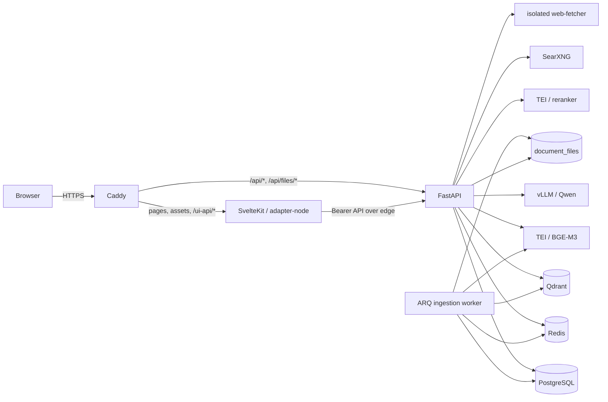
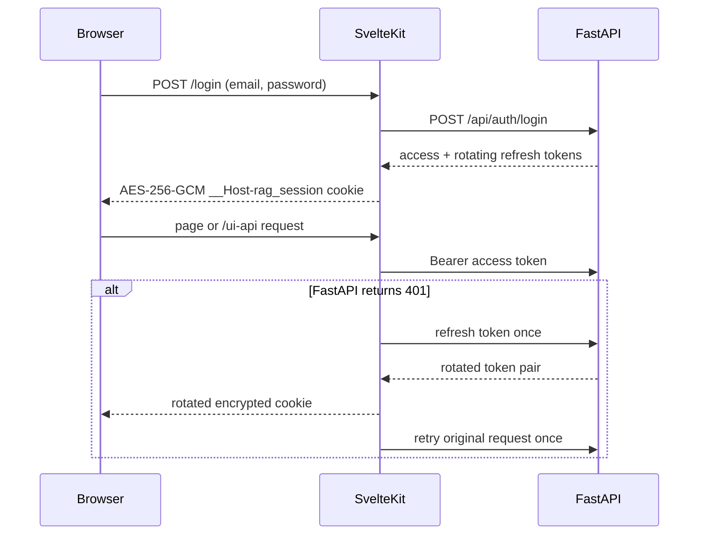
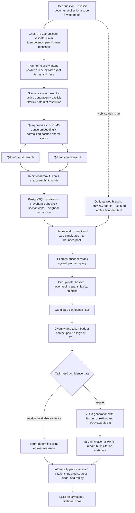

# ETOERAGCB architecture

This is the technical handoff for the closed-registration, multi-tenant RAG
application. PostgreSQL is authoritative for identity, tenancy, document
visibility, ingestion state, active index generations, and chat history.
Qdrant is a derived retrieval index; Redis is disposable queue/cache state.

The current deployment remains LAN-only. Public DNS/ACME and the final host
reboot drill remain explicit release gates.

## System overview


```mermaid
flowchart LR
    Browser -->|HTTPS| Caddy
    Caddy -->|pages, assets, /ui-api/*| Frontend["SvelteKit / adapter-node"]
    Caddy -->|/api/*, /api/files/*| API["FastAPI"]
    Frontend -->|Bearer API over edge| API

    API --> PG[(PostgreSQL)]
    API --> Redis[(Redis)]
    API --> Qdrant[(Qdrant)]
    API --> VLLM["vLLM / Qwen"]
    API --> Embed["TEI / BGE-M3"]
    API --> Rerank["TEI / reranker"]
    API --> Searx["SearXNG"]
    API --> Fetcher["isolated web-fetcher"]

    Worker["ARQ ingestion worker"] --> PG
    Worker --> Redis
    Worker --> Qdrant
    Worker --> Embed
    Worker --> Files[(document_files)]
    API --> Files
```

Caddy is the only host-published service. Browser requests never reach an
internal service directly. SvelteKit is a backend-for-frontend: it receives
credentials, keeps bearer/refresh tokens inside an encrypted HttpOnly cookie,
and calls FastAPI over the private `edge` network. The browser sees application
JSON and SSE through `/ui-api/*`, never backend tokens.

## Repository map

| Path | Responsibility |
|---|---|
| `backend/app/auth/` | Login, rotating refresh tokens, principals, roles, and rate limiting |
| `backend/app/sessions/` | Private sessions/messages, feedback, and citation previews |
| `backend/app/documents/` | Upload, version, reindex, delete, and signed-file API compatibility |
| `backend/app/collections/` | Tenant collections and document membership |
| `backend/app/ingest/` | Durable parsing, chunking, embedding, indexing, activation, reconciliation |
| `backend/app/rag/` | Scope, planning, retrieval, web evidence, reranking, gating, context packing |
| `backend/app/chat/` | Atomic generation, citation repair, SSE, replay, and stored provenance |
| `backend/app/operations/` | Backup verification, retention, and maintenance |
| `frontend/src/lib/server/` | Encrypted session and FastAPI gateway |
| `frontend/src/routes/` | Login, chat, documents, collections, and `/ui-api` handlers |
| `frontend/src/lib/components/` | Safe Markdown, chat messages, citation dialog |
| `frontend/tests/` | Deterministic mock FastAPI and Playwright browser flows |
| `deploy/compose.yml` | Hardened runtime topology |
| `deploy/Caddyfile*` | Public-ACME and LAN ingress variants |
| `docs/p12-sveltekit.md` | P12 migration contract, acceptance, cutover, and rollback |

The removed `streamlit_app/` remains available in Git history. P9 evidence is
retained in `docs/p9-streamlit.md` and marked historical.

## Runtime and trust boundaries

### Caddy

Caddy publishes only TCP 80/443. It redirects HTTP, limits bodies to 55 MB,
preserves HSTS and common security headers, hides private readiness/metrics,
routes `/api/*` and `/api/files/*` to FastAPI, and sends pages/assets plus
`/ui-api/*` to `frontend:3000`. `/ui-api/chat` and `/api/*` use immediate proxy
flush behavior for SSE.

SvelteKit owns the HTML Content Security Policy. Its nonce-mode CSP permits
same-origin scripts/styles and forbids frames, objects, and unsafe script
directives. Caddy must not replace it with a generic HTML CSP.

### SvelteKit frontend

The production frontend is a standalone Node 24.18.0 server generated with
`adapter-node`. Direct dependencies and the Node base image are immutable.
`ORIGIN` must equal the external HTTPS origin so generated URLs and origin
checks remain correct behind Caddy.

Server-side loads and actions fetch initial data. Browser mutations and chat
use a strict `/ui-api` allowlist. The gateway applies bounded timeouts, maps
errors to stable generic messages, validates upstream JSON, and never logs
passwords, tokens, uploads, citation preview text, or document content.

Raw HTML is escaped before Markdown formatting. External links are limited to
credential-free HTTP(S) URLs and rendered with `noopener noreferrer`.

### FastAPI

FastAPI remains the public bearer-token API and the authority for
authentication/authorization. Its middleware enforces allowed hosts, CORS,
state-changing request origins, bounded request IDs, no-store token responses,
structured request logging, and metrics.

The API does not trust SvelteKit for tenancy. Every backend query remains
principal- and tenant-scoped.

### Data, model, and web services

- PostgreSQL 16 stores authoritative relational data and durable job state.
- Qdrant stores dense/sparse vectors with provenance but is rehydrated through
  PostgreSQL under active tenant/version scope.
- Redis holds ARQ delivery, rate limits, and version-bound caches.
- vLLM and TEI run pinned local model snapshots with no general Internet route.
- SearXNG and `web-fetcher` use separate egress networks. Only the fetcher can
  fetch pages; it receives no application secrets or data/model network access.

## Network membership

| Network | Members and purpose |
|---|---|
| `edge` (internal) | Caddy, frontend, backend, Prometheus/Alertmanager |
| `data` (internal) | backend/worker, PostgreSQL, Redis, Qdrant, backup helpers |
| `model` (internal) | backend/worker and local model services |
| `search` (internal) | backend, SearXNG, web-fetcher |
| `caddy_egress` | Caddy certificate/public access |
| `search_egress` | SearXNG only |
| `fetch_egress` | web-fetcher only |
| `backup_egress` | rclone helpers only |
| `alert_egress` | Alertmanager only |

The frontend joins only `edge`. It cannot reach PostgreSQL, Redis, Qdrant,
storage, model services, or the web-fetcher. Containers use read-only roots,
dropped capabilities, `no-new-privileges`, tmpfs scratch space, non-root users
where supported, and explicit resource limits.

## Authentication and session flow


```mermaid
sequenceDiagram
    participant B as Browser
    participant F as SvelteKit
    participant A as FastAPI

    B->>F: POST /login (email, password)
    F->>A: POST /api/auth/login
    A-->>F: access + rotating refresh tokens
    F-->>B: AES-256-GCM __Host-rag_session cookie

    B->>F: page or /ui-api request
    F->>A: Bearer access token
    alt FastAPI returns 401
        F->>A: refresh token once
        A-->>F: rotated token pair
        F-->>B: rotated encrypted cookie
        F->>A: retry original request once
    end
```

The `__Host-rag_session` cookie is `Secure`, `HttpOnly`, `SameSite=Lax`, and
`Path=/`. Its versioned JSON bundle is encrypted and authenticated with
AES-256-GCM using the independent `frontend_session_secret`. The hard expiry is
the refresh expiry; tampered, undecryptable, or expired cookies are cleared.

Concurrent refreshes are deduplicated by a SHA-256 hash of the old refresh
token. A bounded ten-second rotation result cache lets simultaneous requests
that carried the old cookie receive the same replacement rather than trigger
FastAPI refresh-token reuse detection. The cache never stores a plaintext hash
input or exposes the result to browser JavaScript.

Tenant switching performs a password-confirmed FastAPI login for the target
tenant, revokes the prior refresh token best-effort, replaces the cookie, and
reloads all tenant-scoped UI state. Existing Streamlit sessions intentionally
do not migrate.

## Chat, SSE, and citations

The browser creates one UUID and idempotency key per question. A reconnect
reuses the same body, UUID, and key. FastAPI claim/replay semantics therefore
make one reconnect safe.

SSE events are `start`, `status`, `delta`, `replace`, `citations`, `done`, and
`error`. Unknown events are ignored. `replace` always supersedes accumulated
deltas. A stream without `done`/`error` may reconnect once; replay returns the
stored authoritative transcript.

Assistant message metadata stores both the citation map and packed retrieval
sources. Document source metadata retains the PostgreSQL chunk candidate UUID,
content hash, and document/version/section/chunk provenance.

`GET /api/messages/{message_id}/citations/{source_id}/preview`:

- accepts only an assistant message owned by the active user and tenant;
- resolves a document citation through both stored citation and retrieval data;
- cross-checks chunk, tenant, document, version, optional section/index, and
  content hash;
- requires a non-deleted document and a ready/active/superseded,
  non-garbage-collected version;
- returns exact `Chunk.text_original` with `Cache-Control: private, no-store`;
- returns the same generic 404 for malformed, web, cross-user, cross-tenant,
  deleted, collected, missing, or mismatched sources.

The UI displays document/title/page and fetches only preview JSON into a
plain-text `<dialog>`. It closes by button, Escape, or backdrop and restores
trigger focus. Older removed evidence shows “Preview is no longer available.”
Web citations remain validated external links. Signed-file routes stay
available to API clients but are not used by the SvelteKit UI.

## Document and retrieval lifecycle

Uploads are bounded to 50 MB at Caddy, SvelteKit, and FastAPI. Administrators
can add documents/versions, reindex, delete, and edit collection membership.
Members can inspect inventory and ingestion status.

The ingestion worker stores the raw version, creates normalized sections and
chunks, embeds and indexes a new generation, and atomically activates it.
Failed versions never replace the active version. PostgreSQL's generation
manifest governs which Qdrant points are visible. Retention can garbage-collect
superseded evidence only after the backup safety gate; previews then
intentionally return 404.

Chat retrieval performs bounded planning, tenant-authorized scope resolution,
hybrid dense/sparse retrieval, optional isolated web retrieval, reranking,
deduplication/diversity, confidence gating, context packing, local generation,
citation repair, and atomic persistence.

## RAG: retrieval and generation control map

This section is the practical map for changing the RAG pipeline. Line ranges
refer to the current source tree; prefer the named class or function when a
later edit shifts a range. The important boundary is that **PostgreSQL decides
which evidence is eligible**, Qdrant only proposes chunk IDs, and the model only
sees the evidence that survives post-retrieval processing and context packing.

### End-to-end query path


```mermaid
flowchart TD
    U["User question + explicit document/collection scope + web toggle"]
    A["Chat API: authenticate, validate, claim idempotency, persist user message"]
    P["Planner: classify intent, rewrite query, extract exact terms and hints"]
    S["Scope resolver: tenant + active generation + explicit filters + safe hint resolution"]
    Q["Query features: BGE-M3 dense embedding + normalized hashed sparse vector"]
    D1["Qdrant dense search"]
    D2["Qdrant sparse search"]
    F["Reciprocal-rank fusion + exact-term/hint boosts"]
    H["PostgreSQL hydration + provenance checks + section caps + neighbor expansion"]
    W["Optional web branch: SearXNG search + isolated fetch + bounded text"]
    M["Interleave document and web candidates into bounded pool"]
    R["TEI cross-encoder rerank against planned query"]
    DD["Deduplicate: hashes, overlapping spans, lexical shingles"]
    CF["Candidate confidence filter"]
    C["Diversity and token-budget context pack; assign S1, S2, ..."]
    G{"Calibrated confidence gate"}
    NA["Return deterministic no-answer message"]
    L["vLLM generation with history, question, and SOURCE blocks"]
    CR["Stream citation allow-list repair; build citation metadata"]
    DB["Atomically persist answer, citations, packed sources, usage, and replay"]
    SSE["SSE: delta/replace, citations, done"]

    U --> A --> P --> S --> Q
    Q --> D1 --> F
    Q --> D2 --> F
    F --> H --> M
    U -. "web_search=true" .-> W --> M
    M --> R --> DD --> CF --> C --> G
    G -- "weak/unavailable evidence" --> NA --> DB
    G -- answer --> L --> CR --> DB --> SSE
```

There are two deliberate short paths. A planner result of `smalltalk` or
`meta` skips document vector retrieval and uses the ungrounded conversation
prompt. A `knowledge` request whose calibrated gate does not pass never calls
the generator; it returns a stable no-answer response instead. Web search can
run beside document retrieval, but its failure is contained and document
retrieval remains authoritative.

### 1. Entry, query planning, and scope

- `backend/app/chat/routes.py` lines 26-95 is the HTTP/SSE entry point. It
  validates the idempotency key, accepts the request, and converts coordinator
  events into SSE frames. `backend/app/chat/schemas.py` lines 9-33 defines the
  controllable request inputs: question, session, explicit collection/document
  IDs, web-search toggle, and client request UUID.
- `backend/app/chat/orchestrator.py` lines 103-204 claims idempotency and stores
  the user message; lines 206-409 execute retrieval/generation and emit the
  stream; lines 411-507 bound conversation history. This is the top-level place
  to change stage ordering, branching, persistence, or observable events.
- `backend/app/rag/planner.py` lines 9-58 defines hard query/hint bounds and the
  `RetrievalPlan`: `intent`, rewritten `query`, `exact_terms`, and document,
  collection, and heading hints. Lines 64-139 contain the deterministic vLLM
  JSON-schema request (`temperature=0`, thinking disabled); lines 142-172 are
  the failure fallback, which preserves the bounded user text and extracts
  quoted terms/identifiers. Change the system instruction here to experiment
  with query rewriting or add plan fields here and in all consumers/cache keys.
- `backend/app/rag/service.py` lines 56-118 orchestrates planning, scope,
  feature construction, and retrieval. Notice that both the dense embedding
  and sparse vector use **the planned query**, not necessarily the raw message.
  Lines 120-153 implement fail-open Redis plan/retrieval caches; their keys
  include tenant, active generation, retrieval revision, plan, model revision,
  explicit scope, and algorithm signature so stale evidence is not reused.
- `backend/app/rag/scope.py` lines 70-269 resolves only the tenant's active
  generation manifest. Explicit document/collection IDs are hard filters and
  invalid IDs fail closed. Exact unambiguous planner hints may narrow scope;
  ambiguous/fuzzy hints only create ranking boosts, never authorization. Heading
  matches expand to descendant sections. Lines 271-388 contain the exact/fuzzy
  matching policy (`FUZZY_HINT_MINIMUM` is at line 26). Modify this module for
  metadata interpretation, but never turn model-provided hints into permission.

### 2. Index representation and hybrid document retrieval

Retrieval behavior starts at ingestion, because query-time dense and sparse
features must match the stored representation:

- `backend/app/ingest/chunker.py` lines 44-105 makes tokenizer-aligned,
  overlapping chunks, preserving original and normalized lexical text, offsets,
  pages, hashes, and stable IDs. `CHUNK_TOKENS` and `CHUNK_OVERLAP` therefore
  change both recall and index cardinality and require reindexing.
- `backend/app/ingest/embedder.py` lines 18-99 calls TEI `/tokenize` and `/embed`,
  validates token offsets and `EMBED_DIM`, and refuses silent truncation.
  `backend/app/ingest/hashing.py` lines 41-53 creates the normalized hashed
  bag-of-terms sparse vector (log term frequency, L2 normalization).
- `backend/app/ingest/jobs.py` lines 39-500 owns parse -> section -> chunk ->
  embed -> Qdrant upsert -> validation -> atomic generation activation.
  `backend/app/ingest/indexer.py` lines 45-115 defines Qdrant's cosine `dense`
  and on-disk `sparse` vectors plus scope/provenance payload indexes. Changing
  embedding models, dimensions, sparse hashing, chunk identity, or payloads is
  an ingestion/index migration, not just a query-time change.
- `backend/app/rag/retriever.py` lines 85-157 sends independent dense and sparse
  Qdrant queries with tenant, generation, version, document, and optional
  section filters. Lines 159-240 fuse the branches, hydrate candidates from
  PostgreSQL, apply limits, and add neighboring chunks. Lines 285-459 implement
  RRF (`RRF_K=60`), exact-term/hint boosts, deterministic ties, and per-section
  caps; lines 460-543 load neighbors. Qdrant text/payload is not trusted as the
  final evidence: hydration rechecks active PostgreSQL rows and content hashes.

The document ranking sequence is: dense rank + sparse rank -> reciprocal-rank
fusion -> exact-term and metadata-hint boosts -> deterministic ordering ->
per-section cap -> optional same-section neighbors. `RETRIEVE_DENSE_N` and
`RETRIEVE_SPARSE_N` control branch recall; `RERANK_POOL_N` bounds the fused pool;
`SECTION_CHUNK_LIMIT` limits concentration before reranking; and
`SECTION_NEIGHBOR_RADIUS` trades topical continuity for pool space.

### 3. Optional web evidence and candidate merging

- `backend/app/rag/combined.py` lines 60-105 runs document retrieval and, only
  when requested, web retrieval concurrently. Lines 107-114 isolate all web
  errors. Lines 125-155 deterministically interleave document and web ranks up
  to the rerank pool limit; this is the place to replace equal interleaving with
  a source weighting or quota policy.
- `backend/app/rag/web.py` lines 60-120 implement bounded SearXNG search, lines
  122-159 call the isolated fetcher, and lines 161-224 deduplicate URLs, fetch
  concurrently, and produce web candidates. Lines 227-289 validate results,
  bound searchable text, and retain URL/title/domain provenance. Network and
  payload controls live in `backend/app/web/` and the isolated `web-fetcher`
  deployment; do not move arbitrary URL fetching into the backend container.

Web uses the raw user message for search (`combined.py` line 79), whereas
document retrieval and reranking use the planned query (`combined.py` lines
96-99). This is an explicit modification point if experiments should make web
search use the rewrite, multiple queries, or planner-generated web terms.

### 4. Reranking, deduplication, filtering, and context diversity

`backend/app/rag/postprocess.py` lines 45-63 is the exact post-retrieval order:

1. `backend/app/rag/reranker.py` lines 34-97 bounds candidates and orders them
   by TEI cross-encoder score, then retrieval rank and stable ID. Lines 99-158
   batch original candidate text through `/rerank`, require one normalized
   `[0,1]` score per item, and fail the request rather than silently using bad
   scores. Lines 160-194 implement a content-hash/model-revision-aware cache.
2. `backend/app/rag/dedup.py` lines 26-73 retains the best-ranked copy and records
   every drop. Lines 76-136 compare exact content hash, normalized lexical hash,
   same-source character-span overlap (default `0.80`), then 3-token Jaccard
   similarity (default `0.85`). Evidence carrying a unique exact-term match is
   preserved; lines 139-158 merge provenance of collapsed candidates. The two
   thresholds are code defaults, not environment variables.
3. `backend/app/rag/confidence.py` lines 30-73 keeps candidates scoring at least
   `max(CONTEXT_RERANK_SCORE_MIN, top_score - CONTEXT_RERANK_TOP_DELTA)` and
   records whether each rejection was absolutely weak or too far from the best.
4. `backend/app/rag/context.py` lines 115-210 orders and packs surviving evidence
   under candidate, section, source/document, domain, web-source, and exact token
   limits. Lines 213-243 first reserve representatives for unmatched exact terms
   and available document/web source types. Lines 246-269 assign stable `[S#]`
   blocks; web text is visibly wrapped as untrusted data. This is the principal
   place to experiment with diversity, ordering, source quotas, or formatting.
5. `backend/app/rag/gate.py` lines 114-123 loads and hashes the committed
   calibration artifact. Lines 126-186 verify embedding/reranker revisions and
   decide `answer` versus `no_answer` from candidate count, top score, top-two
   margin, and an exact-term exception. Thresholds come from
   `backend/app/rag/calibration/retrieval_gate.v1.json`; recalibrate rather than
   casually tuning a production gate against anecdotal questions.

The candidate confidence filter and final gate are different controls: the
filter decides **what the model may see**; the gate decides **whether the model
may answer at all**. The gate evaluates only packed evidence, so context quotas
and token budget can affect the route.

### 5. Prompt construction, generation, citations, and storage

- `backend/app/chat/prompts.py` lines 5-35 contains both system prompts and the
  final message assembly. Knowledge answers receive bounded history, the raw
  latest question, and packed source blocks; they are instructed to use only
  sources, treat them as untrusted, answer in the user's language, and cite
  factual claims. Smalltalk/meta receives no retrieval context and must not cite.
- `backend/app/chat/orchestrator.py` lines 254-333 selects grounded/no-answer
  routing, constructs prompts, and streams generation. Its prompt budget is
  computed during runtime wiring so model input, history, context, and output
  remain within `MAX_MODEL_LEN`.
- `backend/app/chat/generator.py` lines 27-101 calls vLLM's streaming chat
  completions endpoint with configured model and output bound, parses deltas,
  captures usage, and maps malformed/failed streams to `GenerationError`.
- `backend/app/chat/citations.py` lines 22-97 buffers partial markers during
  streaming and emits only complete allow-listed `[S#]` markers. Lines 100-127
  build public citation metadata only for markers actually used; lines 130-150
  remove invented/incomplete/adjacent duplicate markers and preserve first-use
  order. If repair changes already-streamed text, the coordinator emits an
  authoritative `replace` event.
- `backend/app/chat/orchestrator.py` lines 335-409 atomically stores final text,
  citation map, packed-source provenance, gate/planner decisions, model usage,
  and the idempotent replay transcript before emitting `done`. Citation preview
  authorization and content revalidation live in
  `backend/app/sessions/routes.py` lines 197-374; that path deliberately
  retrieves original PostgreSQL chunk text rather than trusting client-supplied
  citation data.

Citation repair validates marker existence, not whether every factual sentence
has a citation or whether a citation semantically entails a claim. Stronger
claim-level citation coverage or entailment checking would be a new stage after
generation and before atomic persistence.

### Control surface and safe experimentation

| Goal | Primary control | Code-level control / consequence |
|---|---|---|
| Query rewriting, intent, exact terms, hints | Planner prompt/schema | `rag/planner.py`; update cache signatures and tests when schema/semantics change |
| Hard corpus selection | Request document/collection IDs | `rag/scope.py`; always retain tenant + active-generation checks |
| Chunk size and overlap | `CHUNK_TOKENS`, `CHUNK_OVERLAP` | Reindex all affected documents |
| Dense/sparse recall | `RETRIEVE_DENSE_N`, `RETRIEVE_SPARSE_N` | `rag/retriever.py`; larger values increase Qdrant/hydration cost |
| Fusion and boosts | `RRF_K`, `_rank_hydrated` | Code-only; bump `retrieval_signature` to invalidate cache |
| Neighbor/context locality | `SECTION_CHUNK_LIMIT`, `SECTION_NEIGHBOR_RADIUS` | Changes candidate composition before reranking |
| Reranker breadth/output | `RERANK_POOL_N`, `RERANK_KEEP` | Pool also bounds combined web/document candidates; keep bounds context candidates |
| Remove weak evidence | `CONTEXT_RERANK_SCORE_MIN`, `CONTEXT_RERANK_TOP_DELTA` | Candidate filter runs after dedup and before packing |
| Duplicate sensitivity | `deduplicate()` thresholds | Code-only defaults; add config if frequent experiments are intended |
| Context size/diversity | `CONTEXT_TOKEN_BUDGET`, `DOCUMENT_CHUNK_LIMIT`, `DOMAIN_CHUNK_LIMIT`, `WEB_CONTEXT_LIMIT` | `rag/context.py`; token count comes from the serving tokenizer |
| Abstention | `RETRIEVAL_GATE_CONFIG` artifact | Calibrate with `backend/app/evaluation/`; artifact is model-revision bound |
| Web breadth/safety | `WEB_TOP_RESULTS`, fetch timeout/concurrency/redirect/byte/text limits | `rag/web.py`, `app/web/`, isolated fetcher and network policy |
| History and output | `HISTORY_TURNS`, `HISTORY_TOKEN_BUDGET`, `MAX_NEW_TOKENS`, `MAX_MODEL_LEN` | Cross-field validation prevents total reserved tokens exceeding model length |
| Citation syntax/repair | Grounding prompt and `chat/citations.py` | Keep source IDs synchronized with `ContextPacker` formatting |
| Reproducibility/cache | `CACHE_PLAN_TTL`, `CACHE_RETRIEVAL_TTL`, `CACHE_RERANK_TTL`, `CACHE_ANSWER_TTL` | Cache failures are non-fatal; revisions/generation/signatures prevent stale reuse |

All validated knobs and cross-field constraints are declared in
`backend/app/config.py` lines 53-123 and 206-239. Deployment values originate in
`deploy/.env.example` and are passed to backend/worker services by
`deploy/compose.yml`; copy the example to the uncommitted `deploy/.env` for a
local experiment. Model identities are pinned in `model-revisions.lock` and
changing a model revision can intentionally make the confidence gate abstain
until a matching artifact is installed.

For controlled experiments, change one stage at a time, add its parameters and
model/index revisions to cache provenance, reindex when the stored
representation changes, and record retrieval candidates, rerank/dedup/filter
decisions, packed sources, gate result, final citations, latency, and answer
quality. Relevant regression coverage can be located with
`rg -l "app.rag|app.chat" backend/tests`, while evaluation tooling lives in
`backend/app/evaluation/`; run backend lint, strict typing, and the full test
suite before comparing results.

## Configuration and reproducibility

Python dependencies remain hash-locked for Python 3.13. Frontend dependencies
are exact direct pins plus `package-lock.json` and `npm ci`. Application and
third-party image digests are recorded in `docker-images.lock`; model revisions
are in `model-revisions.lock`.

Frontend runtime configuration:

| Variable/secret | Purpose |
|---|---|
| `ORIGIN=https://${PUBLIC_DOMAIN}` | External origin behind Caddy |
| `API_INTERNAL_URL=http://backend:8000/api` | Private FastAPI target |
| `BODY_SIZE_LIMIT=55M` | SvelteKit request bound |
| `SHUTDOWN_TIMEOUT=30` | Graceful adapter-node shutdown |
| `frontend_session_secret` | Independent 32-byte cookie encryption key |

## Verification

Backend:

```bash
cd backend
uv sync --frozen --all-groups
uv run ruff check .
uv run ruff format --check .
uv run mypy app
uv run pytest
```

Frontend:

```bash
cd frontend
npm ci
npm run format:check
npm run lint
npm run check
npm test
npm run build
npm run test:e2e
npm audit --audit-level=high
```

Deployment:

```bash
python3 scripts/verify_compose_boundary.py
docker compose --env-file deploy/.env -f deploy/compose.yml config --quiet
deploy/release-check.sh
```

Acceptance requires only Caddy to publish ports; a healthy frontend; unchanged
`/api/healthz`; a nonce CSP without unsafe scripts; bounded uploads; unbuffered
chat; no citation `/api/files/*` request; and successful button/Escape/backdrop
dialog closure.

## Cutover and rollback

Cutover is atomic at the Caddy upstream:

1. Record the pre-cutover Git SHA and retain/tag the working Streamlit image.
2. Create `frontend_session_secret`; build/start `frontend` internally.
3. Validate its health, login, chat replay, upload, and preview.
4. Recreate Caddy with the frontend upstream.
5. Run HTTPS and CSP smokes, then remove the orphaned Streamlit container.

Rollback restores the recorded Git revision/Caddy configuration and recreates
the retained Streamlit service. The P12 backend endpoint has no migration, so
no database rollback is needed. Users sign in again after either transition.
