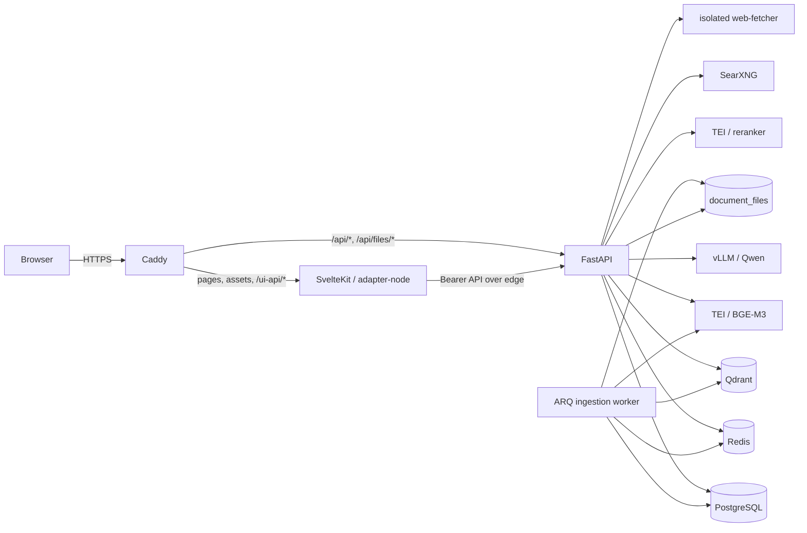
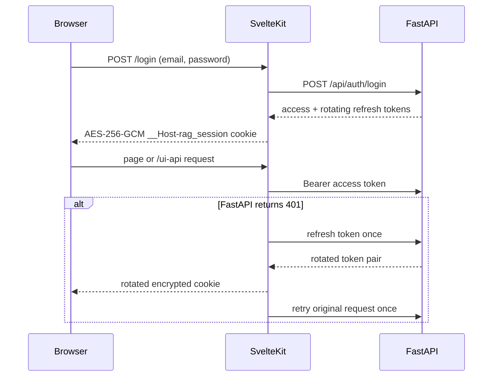

# ETOERAGCB architecture

This is the technical handoff for the closed-registration, multi-tenant RAG
application. PostgreSQL is authoritative for identity, tenancy, document
visibility, ingestion state, active index generations, and chat history.
Qdrant is a derived retrieval index; Redis is disposable queue/cache state.

The current deployment remains LAN-only. Public DNS/ACME and the final host
reboot drill remain explicit release gates.

## System overview


```mermaid
flowchart LR
    Browser -->|HTTPS| Caddy
    Caddy -->|pages, assets, /ui-api/*| Frontend["SvelteKit / adapter-node"]
    Caddy -->|/api/*, /api/files/*| API["FastAPI"]
    Frontend -->|Bearer API over edge| API

    API --> PG[(PostgreSQL)]
    API --> Redis[(Redis)]
    API --> Qdrant[(Qdrant)]
    API --> VLLM["vLLM / Qwen"]
    API --> Embed["TEI / BGE-M3"]
    API --> Rerank["TEI / reranker"]
    API --> Searx["SearXNG"]
    API --> Fetcher["isolated web-fetcher"]

    Worker["ARQ ingestion worker"] --> PG
    Worker --> Redis
    Worker --> Qdrant
    Worker --> Embed
    Worker --> Files[(document_files)]
    API --> Files
```

Caddy is the only host-published service. Browser requests never reach an
internal service directly. SvelteKit is a backend-for-frontend: it receives
credentials, keeps bearer/refresh tokens inside an encrypted HttpOnly cookie,
and calls FastAPI over the private `edge` network. The browser sees application
JSON and SSE through `/ui-api/*`, never backend tokens.

## Repository map

| Path | Responsibility |
|---|---|
| `backend/app/auth/` | Login, rotating refresh tokens, principals, roles, and rate limiting |
| `backend/app/sessions/` | Private sessions/messages, feedback, and citation previews |
| `backend/app/documents/` | Upload, version, reindex, delete, and signed-file API compatibility |
| `backend/app/collections/` | Tenant collections and document membership |
| `backend/app/ingest/` | Durable parsing, chunking, embedding, indexing, activation, reconciliation |
| `backend/app/rag/` | Scope, planning, retrieval, web evidence, reranking, gating, context packing |
| `backend/app/chat/` | Atomic generation, citation repair, SSE, replay, and stored provenance |
| `backend/app/operations/` | Backup verification, retention, and maintenance |
| `frontend/src/lib/server/` | Encrypted session and FastAPI gateway |
| `frontend/src/routes/` | Login, chat, documents, collections, and `/ui-api` handlers |
| `frontend/src/lib/components/` | Safe Markdown, chat messages, citation dialog |
| `frontend/tests/` | Deterministic mock FastAPI and Playwright browser flows |
| `deploy/compose.yml` | Hardened runtime topology |
| `deploy/Caddyfile*` | Public-ACME and LAN ingress variants |
| `docs/p12-sveltekit.md` | P12 migration contract, acceptance, cutover, and rollback |

The removed `streamlit_app/` remains available in Git history. P9 evidence is
retained in `docs/p9-streamlit.md` and marked historical.

## Runtime and trust boundaries

### Caddy

Caddy publishes only TCP 80/443. It redirects HTTP, limits bodies to 55 MB,
preserves HSTS and common security headers, hides private readiness/metrics,
routes `/api/*` and `/api/files/*` to FastAPI, and sends pages/assets plus
`/ui-api/*` to `frontend:3000`. `/ui-api/chat` and `/api/*` use immediate proxy
flush behavior for SSE.

SvelteKit owns the HTML Content Security Policy. Its nonce-mode CSP permits
same-origin scripts/styles and forbids frames, objects, and unsafe script
directives. Caddy must not replace it with a generic HTML CSP.

### SvelteKit frontend

The production frontend is a standalone Node 24.18.0 server generated with
`adapter-node`. Direct dependencies and the Node base image are immutable.
`ORIGIN` must equal the external HTTPS origin so generated URLs and origin
checks remain correct behind Caddy.

Server-side loads and actions fetch initial data. Browser mutations and chat
use a strict `/ui-api` allowlist. The gateway applies bounded timeouts, maps
errors to stable generic messages, validates upstream JSON, and never logs
passwords, tokens, uploads, citation preview text, or document content.

Raw HTML is escaped before Markdown formatting. External links are limited to
credential-free HTTP(S) URLs and rendered with `noopener noreferrer`.

### FastAPI

FastAPI remains the public bearer-token API and the authority for
authentication/authorization. Its middleware enforces allowed hosts, CORS,
state-changing request origins, bounded request IDs, no-store token responses,
structured request logging, and metrics.

The API does not trust SvelteKit for tenancy. Every backend query remains
principal- and tenant-scoped.

### Data, model, and web services

- PostgreSQL 16 stores authoritative relational data and durable job state.
- Qdrant stores dense/sparse vectors with provenance but is rehydrated through
  PostgreSQL under active tenant/version scope.
- Redis holds ARQ delivery, rate limits, and version-bound caches.
- vLLM and TEI run pinned local model snapshots with no general Internet route.
- SearXNG and `web-fetcher` use separate egress networks. Only the fetcher can
  fetch pages; it receives no application secrets or data/model network access.

## Network membership

| Network | Members and purpose |
|---|---|
| `edge` (internal) | Caddy, frontend, backend, Prometheus/Alertmanager |
| `data` (internal) | backend/worker, PostgreSQL, Redis, Qdrant, backup helpers |
| `model` (internal) | backend/worker and local model services |
| `search` (internal) | backend, SearXNG, web-fetcher |
| `caddy_egress` | Caddy certificate/public access |
| `search_egress` | SearXNG only |
| `fetch_egress` | web-fetcher only |
| `backup_egress` | rclone helpers only |
| `alert_egress` | Alertmanager only |

The frontend joins only `edge`. It cannot reach PostgreSQL, Redis, Qdrant,
storage, model services, or the web-fetcher. Containers use read-only roots,
dropped capabilities, `no-new-privileges`, tmpfs scratch space, non-root users
where supported, and explicit resource limits.

## Authentication and session flow


```mermaid
sequenceDiagram
    participant B as Browser
    participant F as SvelteKit
    participant A as FastAPI

    B->>F: POST /login (email, password)
    F->>A: POST /api/auth/login
    A-->>F: access + rotating refresh tokens
    F-->>B: AES-256-GCM __Host-rag_session cookie

    B->>F: page or /ui-api request
    F->>A: Bearer access token
    alt FastAPI returns 401
        F->>A: refresh token once
        A-->>F: rotated token pair
        F-->>B: rotated encrypted cookie
        F->>A: retry original request once
    end
```

The `__Host-rag_session` cookie is `Secure`, `HttpOnly`, `SameSite=Lax`, and
`Path=/`. Its versioned JSON bundle is encrypted and authenticated with
AES-256-GCM using the independent `frontend_session_secret`. The hard expiry is
the refresh expiry; tampered, undecryptable, or expired cookies are cleared.

Concurrent refreshes are deduplicated by a SHA-256 hash of the old refresh
token. A bounded ten-second rotation result cache lets simultaneous requests
that carried the old cookie receive the same replacement rather than trigger
FastAPI refresh-token reuse detection. The cache never stores a plaintext hash
input or exposes the result to browser JavaScript.

Tenant switching performs a password-confirmed FastAPI login for the target
tenant, revokes the prior refresh token best-effort, replaces the cookie, and
reloads all tenant-scoped UI state. Existing Streamlit sessions intentionally
do not migrate.

## Chat, SSE, and citations

The browser creates one UUID and idempotency key per question. A reconnect
reuses the same body, UUID, and key. FastAPI claim/replay semantics therefore
make one reconnect safe.

SSE events are `start`, `status`, `delta`, `replace`, `citations`, `done`, and
`error`. Unknown events are ignored. `replace` always supersedes accumulated
deltas. A stream without `done`/`error` may reconnect once; replay returns the
stored authoritative transcript.

Assistant message metadata stores both the citation map and packed retrieval
sources. Document source metadata retains the PostgreSQL chunk candidate UUID,
content hash, and document/version/section/chunk provenance.

`GET /api/messages/{message_id}/citations/{source_id}/preview`:

- accepts only an assistant message owned by the active user and tenant;
- resolves a document citation through both stored citation and retrieval data;
- cross-checks chunk, tenant, document, version, optional section/index, and
  content hash;
- requires a non-deleted document and a ready/active/superseded,
  non-garbage-collected version;
- returns exact `Chunk.text_original` with `Cache-Control: private, no-store`;
- returns the same generic 404 for malformed, web, cross-user, cross-tenant,
  deleted, collected, missing, or mismatched sources.

The UI displays document/title/page and fetches only preview JSON into a
plain-text `<dialog>`. It closes by button, Escape, or backdrop and restores
trigger focus. Older removed evidence shows “Preview is no longer available.”
Web citations remain validated external links. Signed-file routes stay
available to API clients but are not used by the SvelteKit UI.

## Document and retrieval lifecycle

Uploads are bounded to 50 MB at Caddy, SvelteKit, and FastAPI. Administrators
can add documents/versions, reindex, delete, and edit collection membership.
Members can inspect inventory and ingestion status.

The ingestion worker stores the raw version, creates normalized sections and
chunks, embeds and indexes a new generation, and atomically activates it.
Failed versions never replace the active version. PostgreSQL's generation
manifest governs which Qdrant points are visible. Retention can garbage-collect
superseded evidence only after the backup safety gate; previews then
intentionally return 404.

Chat retrieval performs bounded planning, tenant-authorized scope resolution,
hybrid dense/sparse retrieval, optional isolated web retrieval, reranking,
deduplication/diversity, confidence gating, context packing, local generation,
citation repair, and atomic persistence.

## Configuration and reproducibility

Python dependencies remain hash-locked for Python 3.13. Frontend dependencies
are exact direct pins plus `package-lock.json` and `npm ci`. Application and
third-party image digests are recorded in `docker-images.lock`; model revisions
are in `model-revisions.lock`.

Frontend runtime configuration:

| Variable/secret | Purpose |
|---|---|
| `ORIGIN=https://${PUBLIC_DOMAIN}` | External origin behind Caddy |
| `API_INTERNAL_URL=http://backend:8000/api` | Private FastAPI target |
| `BODY_SIZE_LIMIT=55M` | SvelteKit request bound |
| `SHUTDOWN_TIMEOUT=30` | Graceful adapter-node shutdown |
| `frontend_session_secret` | Independent 32-byte cookie encryption key |

## Verification

Backend:

```bash
cd backend
uv sync --frozen --all-groups
uv run ruff check .
uv run ruff format --check .
uv run mypy app
uv run pytest
```

Frontend:

```bash
cd frontend
npm ci
npm run format:check
npm run lint
npm run check
npm test
npm run build
npm run test:e2e
npm audit --audit-level=high
```

Deployment:

```bash
python3 scripts/verify_compose_boundary.py
docker compose --env-file deploy/.env -f deploy/compose.yml config --quiet
deploy/release-check.sh
```

Acceptance requires only Caddy to publish ports; a healthy frontend; unchanged
`/api/healthz`; a nonce CSP without unsafe scripts; bounded uploads; unbuffered
chat; no citation `/api/files/*` request; and successful button/Escape/backdrop
dialog closure.

## Cutover and rollback

Cutover is atomic at the Caddy upstream:

1. Record the pre-cutover Git SHA and retain/tag the working Streamlit image.
2. Create `frontend_session_secret`; build/start `frontend` internally.
3. Validate its health, login, chat replay, upload, and preview.
4. Recreate Caddy with the frontend upstream.
5. Run HTTPS and CSP smokes, then remove the orphaned Streamlit container.

Rollback restores the recorded Git revision/Caddy configuration and recreates
the retained Streamlit service. The P12 backend endpoint has no migration, so
no database rollback is needed. Users sign in again after either transition.
